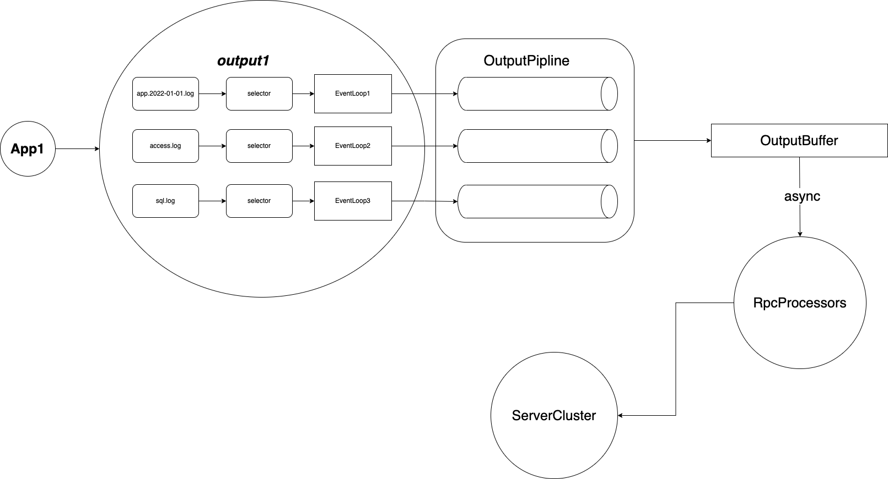

# FileBridge设计

---

# 一、总体结构图

---

# 二、架构介绍

--- 

## 2.1、 EventLoop

---

1. 架构中的核心就是eventloop，它是负责监控文件，并对文件进行读取，并按'行'的方式进行输出数据。一个eventloop实际上会绑定一个线程， 而一个线程则会绑定多个eventloop，总体就是1：n的关系。
所以架构上eventloop是不允许被阻塞的，否则由于平台线程的阻塞会导致所有的evenloop有被阻塞的风险。其中文件io并不算阻塞，因为日志文件的读取通常都是顺序读取，可以有效的利用pageCache，速度上接近内存读取。

2. eventloop的调度上借鉴了"无栈协程"的设计，一个eventloop当成一个被调度的单元，当被调度时进入就绪队列，当需要休眠时进入等待队列，当eventloop的
一次循环执行完毕时则重新进入就绪队列，这样多个eventloop只需要一个线程就可以完成工作。
---

## 2.2、PipLine

---

pipline其实就是日志数据的处理链，包括多行日志合并，lua脚本执行、远程输出等 他是eventloop私有的，也就是运行在单线程下的，所以天然线程安全

## 2.3、Transport

---

### 2.3.1、grpc stream

---

grpc的广泛应用已经证明性能上是毋庸置疑的，例如k8s。 
当前架构上采用的是gpc的客户端stream。它的特点是一元通信，无需服务端的ack,足够高效。 但是目前并没有完全使用流式通信，而是用stream实现低延迟的以'块'发送的通信方式。
原因是ack是必要的，比如日志消费端的服务切换，以及其他原因导致的数据无法投递，是需要重试的 fileBridge原则上需要保障任何日志至少消费一次。 
以传统的方式一条日志一个ack不够高效，多个日志合并成一块再发送则延迟较大。 而基于grpc stream实现块的通信方式可以实现低延迟且高效的效果。例如以10条数据作为一个
流发送到对端，那么这10条数据只需要一次ack，而且每个数据都可以立即发送到对端， 不需要等待10个日志全部生成然后合并成一块再发送

### 2.3.2、限流

---

eventloop本身就有限流的功能，比如下游发送数据太慢，导致evenloop采集的日志数据堆积在内存中，最终内存溢出。 此时eventloop需要感知到下游的负载变化。而实现此功能采用的是高低'水位线'的算法，在低水位线以下
时正常采集日志，在高低水位线之间时，放缓日志采集速率，当超过高水位线是则是完全停止eventloop被调度， 直到水位线恢复到低水平才会被唤醒

## 2.4、offset持久化

---

fileBridge支持从中断处继续进行采集的功能，实现此功能的基础则是需要提交offset。 只有当日志发送成功后才会提交offset，由此可以保障'最多消费一次'的原则

# 三、graalvm的集成

fileBridge目前支持graalvm静态编译能力，静态编译后的二进制包可以完全脱离jvm直接运行，同时由于是二进制包所以会有更低的cpu占用以及内存占用， 更适合云原生的部署要求。

# 四、支持虚拟线程（试验）

通讯层采用的是一个线程绑定一个Rpc处理器，所以一个文件的输出需要绑定一个线程，这也导致了暂时不建议采集大量的日志文件。
目前jdk19的"project loom" preview了，所以项目是可以编译jdk19的版本去支持虚拟线程，从而达到同时输出大量的日志。注意这只是一个试验，建议等待后续jdk21的正式版。
