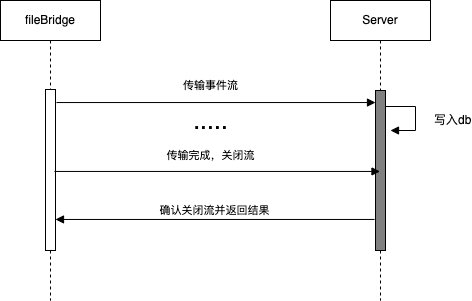

目前并没有提供服务端程序 服务端程序可以用对应平台的protobuf生成器生成代码即可，然后实现对应的rpc服务。<br>
".proto"文件存放在/proto目录下

- Event.proto

```protobuf
syntax = "proto3";

message Event{
  string output = 1; //output 
  string content = 2; //日志内容
  map<string, string> struct = 3; //经过lua脚本解析后的结构化数据
  string id = 4; //事件唯一id
}
```

- Res.proto

```protobuf
syntax = "proto3";
//rpc中的返回值，只有成功和失败两种
message Res{
  enum Status{
    SUCCESS = 0;
    FAILED = 1;
  }
  Status status = 1;
}
```

- EventService.proto

```protobuf
syntax = "proto3";

import "Event.proto";
import "Res.proto";


service EventService{

  //传输数据的rpc接口
  rpc pushAsync(stream Event) returns (Res){};

  //用于健康检查
  rpc healthCheck(Event) returns(Res){};

}
```

时序



